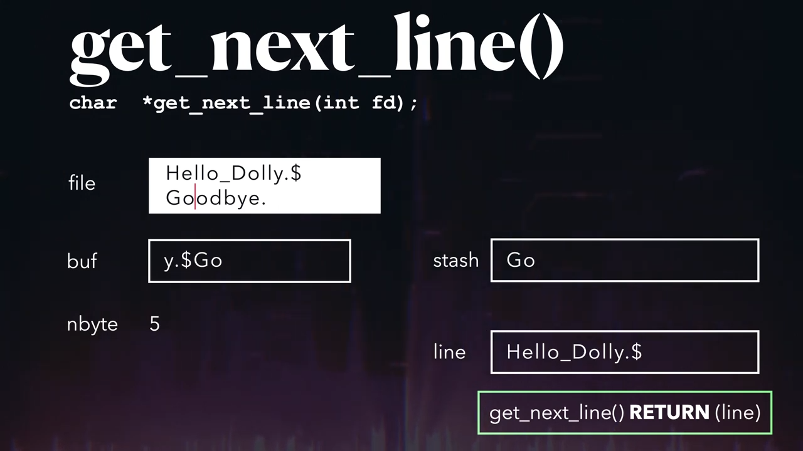

# Get Next Line

This function returns a line from the file descriptor.

With each call to `read()`, buffer content is moved to `stash` to retain data between function calls.

When a newline is encountered, the read line will be:
1. Stored in `stash`.
2. Letters before `\n` extracted and returned to caller.
3. `stash` will clean up what’s extracted, and proceed to read the next line.



## Specifications

- Works when reading a file or standard input.
- `lseek()` and global variables are forbidden.

## Bonus

- Only 1 static variable.
- Manage multiple descriptors at the same time.

## `open()`

This function opens a file and returns a file descriptor.

## `read()`

This function reads n # of bytes from the file referenced by file descriptor into a buffer. 

The function starts at a position given by fd pointer. At the end, pointer is incremented by n # of bytes read.

## Static Variables

Static variables retain data, such that it will not be re-initialized between function calls.

Consider an example:

```c
void counter() {
    static int count = 0;
    count++;
    printf("Count: %d\n", count);
}

int main() {
    counter();  // Output: Count: 1
    counter();  // Output: Count: 2
    counter();  // Output: Count: 3
    return 0;
}
```

When `counter()` is called repeatedly, `count` is only initialized once at beginning, and will retain its value after, giving a different output each time.

`stash` can retain data between function calls, because it uses static variables.

## Docs

- https://yannick.eu/gnl/
- https://medium.com/@ayogun/master-file-i-o-operations-with-42s-get-next-line-project-5fb001d1fff5
- https://harm-smits.github.io/42docs/projects/get_next_line
